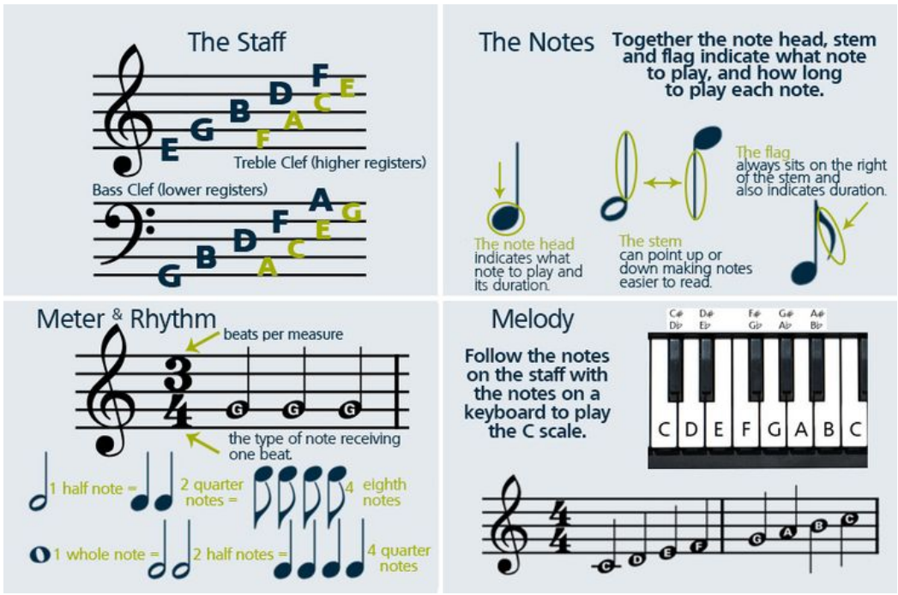

# Optical Sheet Music Recognition 
Our project deals with reading sheet music and generating the audio corresponding to it. We use a wide variety of morphological operations and a vast range of structuring elements corresponding to that.

## Brief Description
Sheet music is handwritten or printed notation that communicates to a musician how to play a piece of music, communicating aural information in a printed form. Typically, a musician refers to sheet music to consult how to play a piece and then plays it manually. The main goal of this project would be to design an image processing algorithm that scans in sheet music and plays the music described on the page, without any human assistance.

The main problem can be subdivided into 2 parts:
1. Detecting different types of notes
    1. Clef Detection
    1. Key Signature Identification
    1. Quarter and Eighth Note Detection
    1. Whole Note and Half Note Detection
    1. Detecting Dotted Notes
    1. Detecting Ties (Not mentioned in the Paper, __NEW__)
    1. Detecting Rests

2. Music synthesis

## Setup and Installation
1. Code is in the form of a ipynb file (Jupyter-Notebook), so make sure to have it Installed. (__Install Jupyter Notebook__)
1. To install the required libraries run the below mentioned command in the project home directory
    1. pip install -r requirements.txt
1. The input images are supposed to be present in the data/inputs directory
1. Run the notebook with appropriate imageName variable in the second cell of the notebook
    1. This is the variable which contains the name of the image file (with extension) on which we want to run our code 
    1. The image file is supposed to be present in the appropriate directory

## Sample outputs
The outputs are present in the data/outs directory

## Team Information
1. Name: skynet
1. Members
    1. Aaditya Sharma (2019113009)
    1. Kartik Garg (2019101060)
    1. Samyak Jain (2019101013)
    1. Tushar Choudhary (2019111019)

## Biblography:
https://web.stanford.edu/class/ee368/Project_Spring_1415/Reports/Verma_Harris.pdf

# Digital-Sheet-Music-Reader
